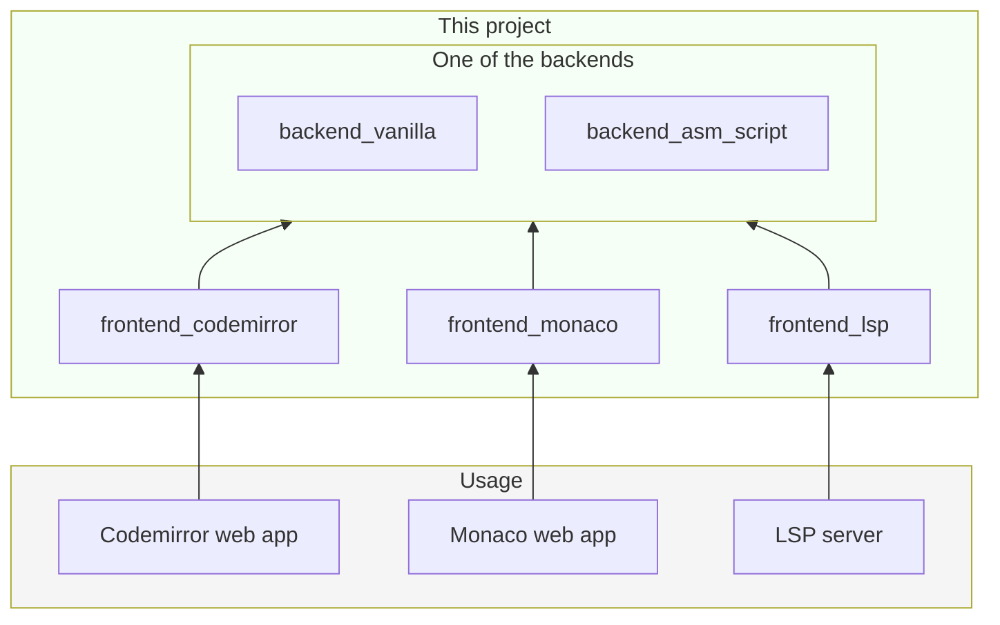

# OpenAPI specification aware REST/HTTP language support

This repo is a monorepo for various npm packages to enable language support for REST/HTTP APIs in various online editors, provided OpenAPI spec.

## User Manual

### First full build

If you just want to download the repo and just want to build it,
just run the following:

```
git clone <git-url> <dir>
cd <dir>
run/fresh # dependency install (no-globals), full build
```

### Tests

After first build you can:

```
run/test # automated tests
run/web # start web server GUIs
```

## Dev manual

If you want to change code as well, the following might come in handy

### Change internal dependencies

```
run/unlink
# here modify run/link, run/unlink scripts
run/link
```

### Change external dependencies / update versions

```
run/install-freeze
```

### Download dependencies

```
run/install
```

### Rebuild

```
run/build
```

## Architecture



## Links

[Codemirror Language Support](https://codemirror.net/docs/ref/#language.LanguageSupport)