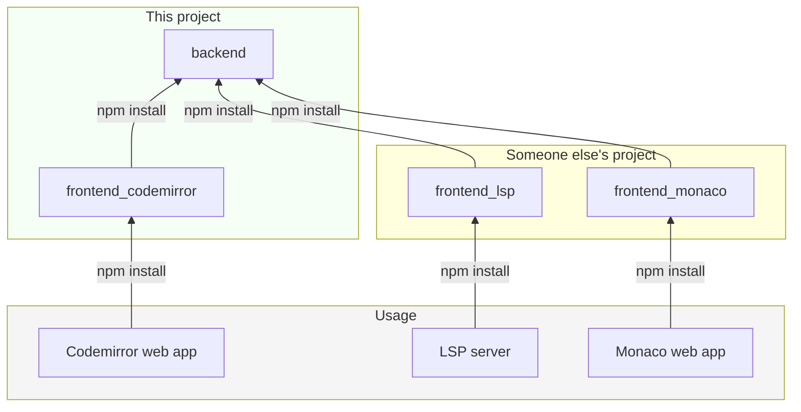

# OpenAPI specification aware REST/HTTP language support

This repo is a monorepo for various npm packages to enable language support for REST/HTTP APIs in various online editors, provided OpenAPI spec.

## User Manual

### Dependencies needed on PATH


- `bash`
- `npm`
- `docker`
   - without sudo
   - for local npm repo so I can publish and install locally
   - without credentials and semver bumps for every single code change
- `jq`
- `curl`
- `grep`
- `xargs`

### First full dev build

If you just want to download the repo and just want to build it,
just run the following:

```
git clone <git-url> <dir>
cd <dir>
run/fresh # dependency install (no-globals), full build
```

### Tests

After first build you can:

```
run/test # automated tests
run/web # start web server GUIs
```

### Beware

- Codemirror packages are heavily deprecated when changing from version 5 to 6
- Having one of these deprecated packages as a dependency usually causes the following error
    ```
    Unrecognized extension value in extension set ([object Object]). This sometimes happens because multiple instances of @codemirror/state are loaded, breaking instanceof checks.
    ```
- Deprecated packages I have accidentally used at some point:
    - `@codemirror/highlight`
    - `@codemirror/rangeset` - which is a dependency of `@codemirror/highlight`

## Architecture



## Links

[Codemirror Language Support](https://codemirror.net/docs/ref/#language.LanguageSupport)
[Codemirror Mixed Language](https://codemirror.net/examples/mixed-language/)
[Lezer docs](https://lezer.codemirror.net/docs/guide/#tokens)
[Codemirror LSP - How it works](https://hjr265.me/blog/codemirror-lsp/)
[Codemirror LSP - repo](https://github.com/FurqanSoftware/codemirror-languageserver/)
[OAS - human readable docs](https://swagger.io/docs/specification/v3_0/about/)
[OAS - spec](https://swagger.io/specification/)
[OAS - actual spec](https://spec.openapis.org)
[OAS 3.0 to 3.1.0](https://www.openapis.org/blog/2021/02/16/migrating-from-openapi-3-0-to-3-1-0)